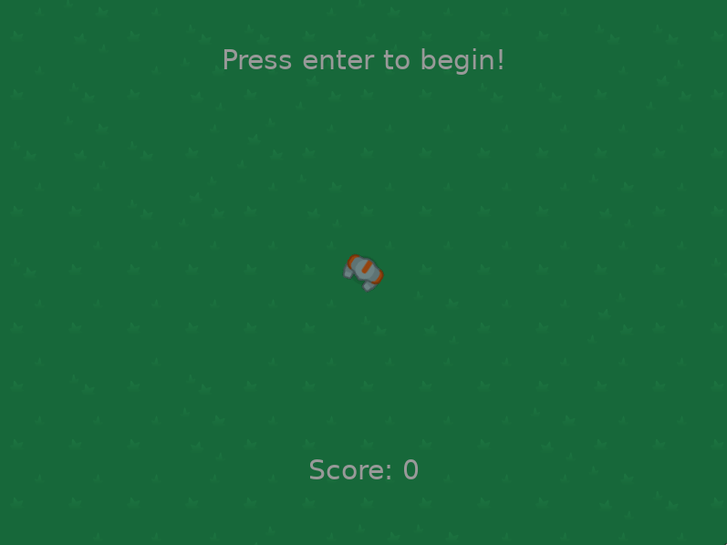

### Simple Lua game created on learning purposes

##### Running the game

Run `love .` inside project root directory.
You can make executable by running `make build`.
Please check makefile for more details.

### Requirments

In order to play you need to have Love2D installed on your computer.
Please visit [Love2D](https://love2d.org/ "Love2D") site for installation instructions.

### Screenshot

